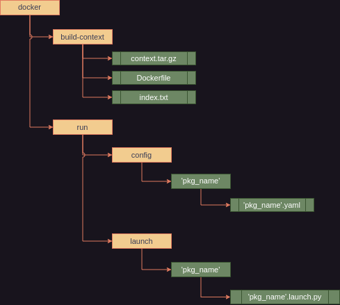

Masters degree diploma project
====================================================
## Overview

My project is a C++ library that implement gui for docker robo containers environment control via docker C++ api. It is designed for cases where standard behavior for communication with docker via CLI tools is insufficient to implement the required tasks.
Here implement client/server request for remote work with robo docker containers!

Features:
- Supports subset of commands that you can post from your `host pc` to `foreign server` and vice verse. (only on localhost) (STUN server support expected later)
- Simple gui for simplify work with robo containers.
- Released under the [**BSD 2-Clause license**].
- Support for **ROS2** (see instructions below).

* Requirements:
    *  List of corresponding robo container that you can build via this project executables should be specified in `index.txt` at `docker/build-context` folder in key value form, where key - name of future image(with `ros2` tag) and value - target from your `Dockerfile` . 
    *  Content of `docker` folder must follow a strict scheme (image below): Here in you can modify what mark green color. Note, that content of build-context should be compress as .tar extension after each modification inside build-context folder. After modify `Dockerfile` your should do corresponding modification in index.txt to reflect modification on client side in gui. `run` folder consist of only two folder, your can add launch and config folder each for one your `launch.py` and `.yaml` files.

It contains:

* server - C++ executable that processes request from `host pc`. Exe consist of subset of C++ class that implements net operation, message handle and interaction with docker web engine API via C++ binds [docker_cpp](https://github.com/sees1/docker_cpp) based on this [repo](https://github.com/aarbelaiz/docker_cpp).
  * To run: 
    * Simple execute using your shell. Note that server open at 4000 port (all interface).
   
* client - C++ executable with Qt5 gui support.
  * To run:
    * Simple execute using your shell
